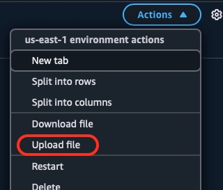

# CloudShell - Install the latest AWS.Tools for PowerShell
by Craig Cooley

Since the CloudShell environment is prebuilt, you can't update the pre-installed modules, but you can download the latest AWS.Tools modules into the CloudShell User directory:

* **Home / User** Directory:  `/home/cloudshell-user/.local/share/powershell/Modules` 
* Read-Only **system** Directory: `/opt/microsoft/powershell/7/Modules/`

When the same PowerShell Module (eg `AWS.Tools.EC2`) is found in both locations, PowerShell defaults to modules in the **user** directory before the modules included with CloudShell system directory.

To install the latest AWS.Tools modules, you can upload the `tools.sh` script to CloudShell (see below)



Mark the script as executable and run `tools.sh`

```shell
chmod +x tools.sh
./tools.sh 
```

Alternatively, you can simply paste the script into the CloudShell console.

Either method will install the latest version of all AWS.Tools modules and launch `pwsh` in less than 5 seconds. 
You can check the module version by running `Get-AWSPowerShellVersion`


* You can ignore the warning message. `Update-AWSToolsModule` will also install moduels to the user folder, however it takes significantly longer to run. 

```
WARNING: You have mismatched versions of the AWS.Tools modules. You can run 'Install-Module AWS.Tools.Installer ; Update-AWSToolsModule' to synchronize the versions of all installed AWS.Tools modules.
```

Note: CloudShell is limited to 1GB local storage and the latest AWS.Tools consumes about .750 GB.  

To remove all AWS.Tools modules from the user directory, run this command from a bash prompt (not PowerShell)
```shell
find "/home/cloudshell-user/.local/share/powershell/Modules" -type d -name "AWS.Tools.*" -exec rm -rf {} \; 2>/dev/null || true
```

### [tools.sh](https://gitlab.aws.dev/coolcrai/cloudshell-install-the-latest-aws-tools/-/raw/main/tools.sh?inline=false)
```shell
# Upload this file to CloudShell, run 'chmod +x tools.sh' and execute from a bash prompt
# Alternate - copy and paste into a CloudShell session
find "/home/cloudshell-user/.local/share/powershell/Modules" -type d -name "AWS.Tools.*" -exec rm -rf {} \; 2>/dev/null || true
curl -s -o AWS.Tools.zip "https://sdk-for-net.amazonwebservices.com/ps/v5/latest/AWS.Tools.zip"
unzip -q -o AWS.Tools.zip -d "/home/cloudshell-user/.local/share/powershell/Modules"
rm -f AWS.Tools.zip
pwsh
```