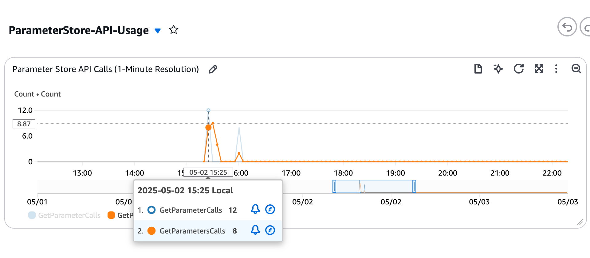
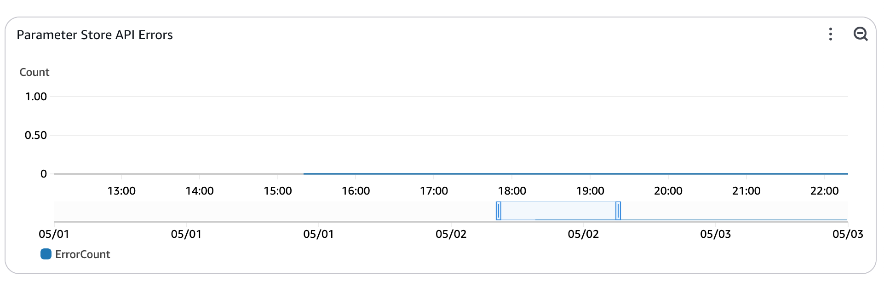

# Monitoring SSM Parameter Store API usage for .NET applications
by Suhail Fouzan

### Introduction
Modern cloud-native .NET applications require robust, secure, and scalable configuration management. AWS Systems Manager Parameter Store offers a centralized, secure solution for storing and managing application configurations, eliminating hard-coded credentials and providing dynamic configuration capabilities. This article explores a solution to implement a comprehensive SSM Parameter store APIs monitoring strategy for developers using Parameter Store for centralized .NET application configuration.

By storing configuration parameters in AWS Systems Manager Parameter Store, .NET applications gain several critical advantages:

- Centralized configuration management
- Enhanced security through hierarchical parameter storage
- Dynamic configuration updates without application restarts
- Fine-grained access control using AWS Identity and Access Management (IAM)

This monitoring solution provides near real-time insights into Parameter Store API interactions, ensuring:

- Continuous configuration availability
- Early detection of potential access issues
- Performance tracking of configuration retrieval
- Proactive identification of potential service disruptions

Through a serverless monitoring approach using AWS Lambda and CloudWatch, developers can create a resilient, scalable solution that guarantees .NET applications maintain optimal configuration access and reliability. This approach transforms configuration management from a potential operational challenge into a streamlined, observable, and secure process.

**Benefits include:**

- Immediate visibility into configuration access patterns
- Automated alerting for unusual API usage
- Detailed metrics tracking configuration retrieval performance
- Simplified operational management of application configurations

The solution demonstrates how strategic monitoring can transform configuration management from a potential point of failure into a robust, transparent operational process for .NET applications running in cloud environments.

### Key Components

- **Data Collection**: AWS Lambda function querying CloudTrail events
- **Metrics**: Custom CloudWatch metrics with 1-minute granularity
- **Visualization**: Near Real-time CloudWatch dashboard
- **Alerting**: Configurable CloudWatch alarms

### Technical Specifications

- **Resolution**: 1-minute intervals
- **Latency**: 5-minute intentional delay to allow CloudTrail latency
- **Deployment**: Single CloudFormation template
- **Runtime**: Python 3.9
- **Execution**: EventBridge scheduled trigger
- **Security**: Least privilege IAM permissions

This solution uses approximately:

- 1,440 invocations/day (1 invocation/min)
- 43,200 invocations/month (30-day month)
- ~4.32% of the monthly free tier (1 million free requests per month)

### Additional optimization options

Example: More frequent during business hours
```
ScheduleExpression: 'cron(0/1 8-18 ? * MON-FRI *)'
```

### Output dashboard





### Cloudformation template for deployment
Use the Cloudformation template below to deploy the solution:

```yaml
AWSTemplateFormatVersion: '2010-09-09'
Description: 'Parameter Store API Usage Monitoring - 1 Minute Resolution'

Resources:
  MonitoringLambdaRole:
    Type: 'AWS::IAM::Role'
    Metadata:
      cfn_nag:
        rules_to_suppress:
          - id: W11
            reason: "The API call is to describe and it does not allow resource level permissions"
    Properties:
      AssumeRolePolicyDocument:
        Version: '2012-10-17'
        Statement:
          - Effect: Allow
            Principal:
              Service: lambda.amazonaws.com
            Action: 'sts:AssumeRole'
      ManagedPolicyArns:
        - 'arn:aws:iam::aws:policy/service-role/AWSLambdaBasicExecutionRole'
      Policies:
        - PolicyName: CloudTrailCloudWatchAccess
          PolicyDocument:
            Version: '2012-10-17'
            Statement:
              - Effect: Allow
                Action:
                  - 'cloudtrail:LookupEvents'
                Resource: '*'
              - Effect: Allow
                Action:
                  - 'cloudwatch:PutMetricData'
                Resource: '*'
                Condition:
                  StringEquals:
                    'cloudwatch:namespace': 'Custom/ParameterStore'

  MonitoringLambda:
    Type: AWS::Lambda::Function
    Metadata:
      cfn_nag:
        rules_to_suppress:
          - id: W89
            reason: "This Lambda function is independent of VPC and does not require to run inside a VPC"
    Properties:
      Handler: index.lambda_handler
      Role: !GetAtt MonitoringLambdaRole.Arn
      Runtime: python3.9
      Timeout: 300
      ReservedConcurrentExecutions: 10
      Code:
        ZipFile: |
          import boto3
          import time
          from datetime import datetime, timedelta
          import os

          def lambda_handler(event, context):
              cloudwatch = boto3.client('cloudwatch')
              cloudtrail = boto3.client('cloudtrail')
              
              # Get events from 6 minutes ago to 5 minutes ago
              # This ensures we capture all events with CloudTrail's latency
              end_time = datetime.utcnow() - timedelta(minutes=5)
              start_time = end_time - timedelta(minutes=1)
              
              try:
                  # Look up CloudTrail events for Parameter Store API calls
                  response = cloudtrail.lookup_events(
                      LookupAttributes=[
                          {
                              'AttributeKey': 'EventSource',
                              'AttributeValue': 'ssm.amazonaws.com'
                          }
                      ],
                      StartTime=start_time,
                      EndTime=end_time
                  )
                  
                  # Initialize counters
                  get_parameter_count = 0
                  get_parameters_count = 0
                  error_count = 0
                  
                  # Process events
                  for event in response['Events']:
                      event_name = event['EventName']
                      event_time = event['EventTime']
                      
                      # Parse CloudTrail event
                      if event_name == 'GetParameter':
                          get_parameter_count += 1
                      elif event_name == 'GetParameters':
                          get_parameters_count += 1
                          
                      # Check for errors in the response elements
                      try:
                          event_response = event.get('ResponseElements', {})
                          if isinstance(event_response, str) and 'error' in event_response.lower():
                              error_count += 1
                      except:
                          pass
                  
                  # Get account and region information
                  account_id = context.invoked_function_arn.split(':')[4]
                  region = os.environ['AWS_REGION']
                  
                  # Publish metrics to CloudWatch with the end_time timestamp
                  # This ensures metrics align with the actual time the events occurred
                  cloudwatch.put_metric_data(
                      Namespace='Custom/ParameterStore',
                      MetricData=[
                          {
                              'MetricName': 'GetParameterCalls',
                              'Value': get_parameter_count,
                              'Unit': 'Count',
                              'Timestamp': end_time,
                              'Dimensions': [
                                  {
                                      'Name': 'Region',
                                      'Value': region
                                  },
                                  {
                                      'Name': 'AccountId',
                                      'Value': account_id
                                  }
                              ]
                          },
                          {
                              'MetricName': 'GetParametersCalls',
                              'Value': get_parameters_count,
                              'Unit': 'Count',
                              'Timestamp': end_time,
                              'Dimensions': [
                                  {
                                      'Name': 'Region',
                                      'Value': region
                                  },
                                  {
                                      'Name': 'AccountId',
                                      'Value': account_id
                                  }
                              ]
                          },
                          {
                              'MetricName': 'ErrorCount',
                              'Value': error_count,
                              'Unit': 'Count',
                              'Timestamp': end_time,
                              'Dimensions': [
                                  {
                                      'Name': 'Region',
                                      'Value': region
                                  },
                                  {
                                      'Name': 'AccountId',
                                      'Value': account_id
                                  }
                              ]
                          }
                      ]
                  )
                  
                  return {
                      'statusCode': 200,
                      'body': f'Metrics published successfully for period ending {end_time.isoformat()}. ' \
                             f'GetParameter: {get_parameter_count}, GetParameters: {get_parameters_count}, ' \
                             f'Errors: {error_count}'
                  }
                  
              except Exception as e:
                  print(f"Error: {str(e)}")
                  raise

  LambdaScheduleRule:
    Type: 'AWS::Events::Rule'
    Properties:
      ScheduleExpression: 'rate(1 minute)'
      State: 'ENABLED'
      Targets:
        - Arn: !GetAtt MonitoringLambda.Arn
          Id: 'MonitoringLambdaTarget'

  LambdaInvokePermission:
    Type: 'AWS::Lambda::Permission'
    Properties:
      FunctionName: !Ref MonitoringLambda
      Action: 'lambda:InvokeFunction'
      Principal: 'events.amazonaws.com'
      SourceArn: !GetAtt LambdaScheduleRule.Arn

  ParameterStoreDashboard:
    Type: 'AWS::CloudWatch::Dashboard'
    Properties:
      DashboardName: 'ParameterStore-API-Usage'
      DashboardBody: !Sub |
        {
          "widgets": [
            {
              "type": "metric",
              "width": 12,
              "height": 6,
              "properties": {
                "metrics": [
                  [ "Custom/ParameterStore", "GetParameterCalls", "Region", "${AWS::Region}", "AccountId", "${AWS::AccountId}", { "stat": "Sum" } ],
                  [ ".", "GetParametersCalls", ".", ".", ".", ".", { "stat": "Sum" } ]
                ],
                "view": "timeSeries",
                "stacked": false,
                "region": "${AWS::Region}",
                "title": "Parameter Store API Calls (1-Minute Resolution)",
                "period": 60,
                "yAxis": {
                  "left": {
                    "label": "Count",
                    "showUnits": true
                  }
                }
              }
            },
            {
              "type": "metric",
              "width": 12,
              "height": 6,
              "properties": {
                "metrics": [
                  [ "Custom/ParameterStore", "ErrorCount", "Region", "${AWS::Region}", "AccountId", "${AWS::AccountId}", { "stat": "Sum" } ]
                ],
                "view": "timeSeries",
                "stacked": false,
                "region": "${AWS::Region}",
                "title": "Parameter Store API Errors",
                "period": 60
              }
            }
          ]
        }
        
  HighUsageAlarm:
    Type: 'AWS::CloudWatch::Alarm'
    Properties:
      AlarmDescription: 'Alert when Parameter Store API usage is high'
      MetricName: 'GetParameterCalls'
      Namespace: 'Custom/ParameterStore'
      Dimensions:
        - Name: Region
          Value: !Ref 'AWS::Region'
        - Name: AccountId
          Value: !Ref 'AWS::AccountId'
      Statistic: 'Sum'
      Period: 60
      EvaluationPeriods: 2
      Threshold: 100
      ComparisonOperator: 'GreaterThanThreshold'
      TreatMissingData: 'notBreaching'
```