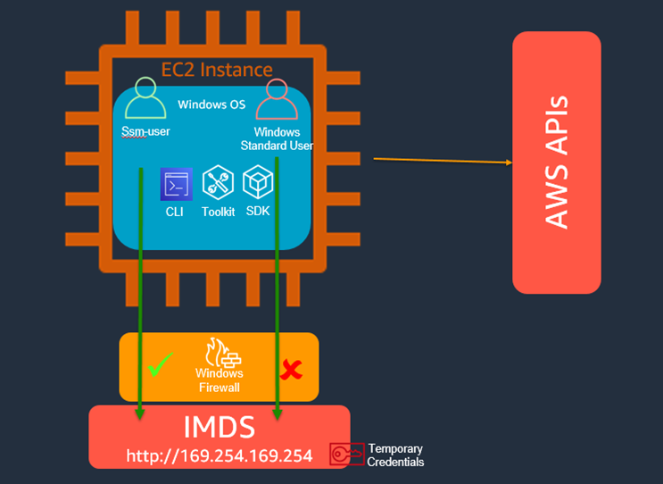
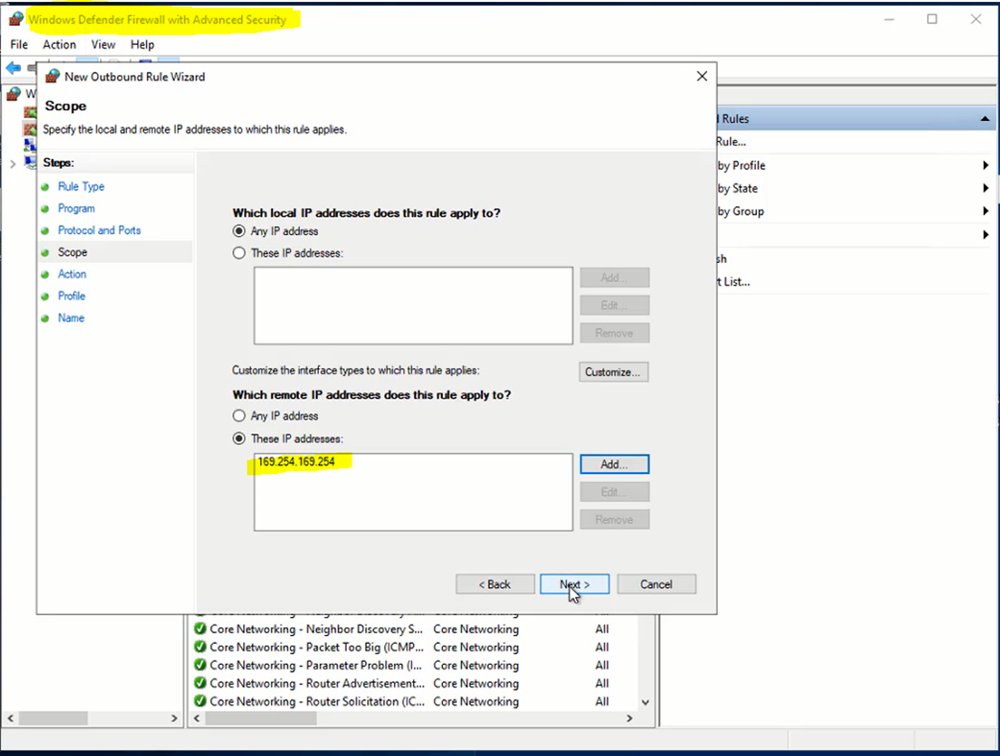
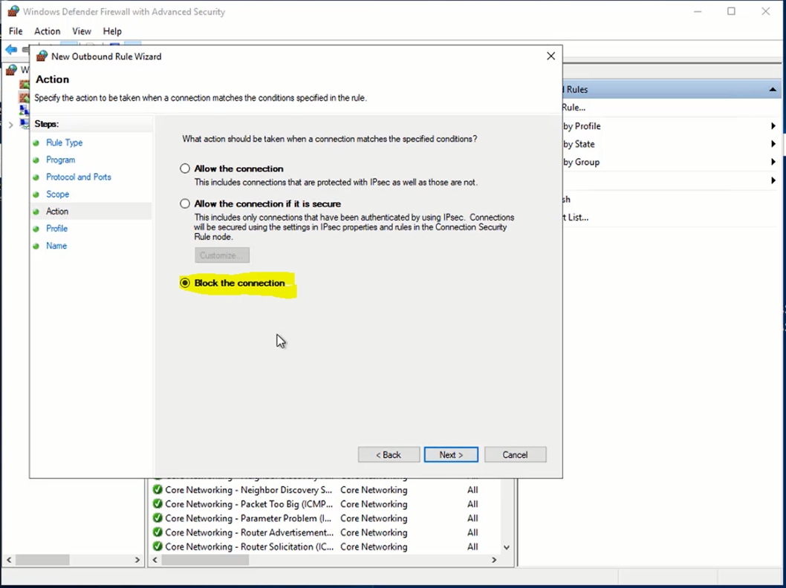
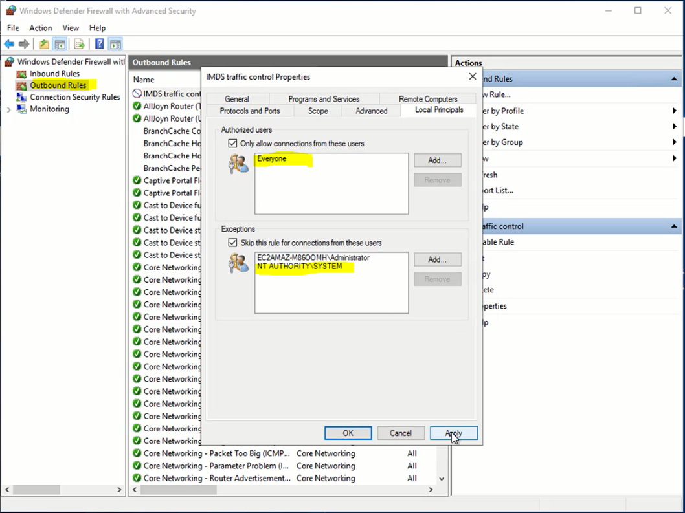

# Restrict EC2 IAM role permission to specific Windows users for AWS Systems Manager. 
by Siavash Irani

## Background
A customer in consulting segment wants to use AWS Systems manager session manager for managing their ec2 instances.

## Challenge
One of the requirement of AWS systems manager is to have an IAM role attached to the instance. This allows ssm-user to interact with AWS using the AWS role permissions. The problem customer had was if they attach an IAM role to the Windows instance, not only it allows ssm-user to interact with AWS, but also any other Windows user which logs in to the instance will have access based on the IAM role. 

## Solution
The proposed solution was to use Windows firewall to block traffic to IMDS(instance meta-data service) to the specific windows user. 

## Solution diagram

## Workflow
1. Use WF.msc to create a new oubound rule. Add 169.254.169.254 as remote address. 

2. Block the connection

3. Apply the rule to everyone and exclude the rule for other users, like System, ssm-user,administrator. 

## Benefits
With this method, customer is able to grant permissions to ssm-user and then block access to other Windows users.

## Potential Cost
There is no cost to create this solution, it’s just a configuration in windows. 
