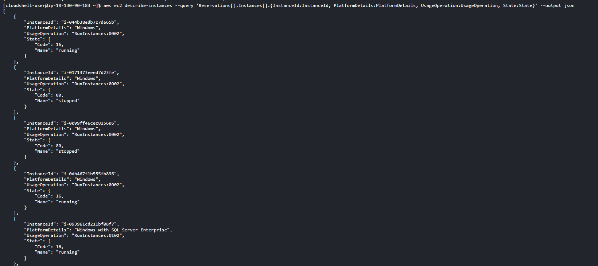
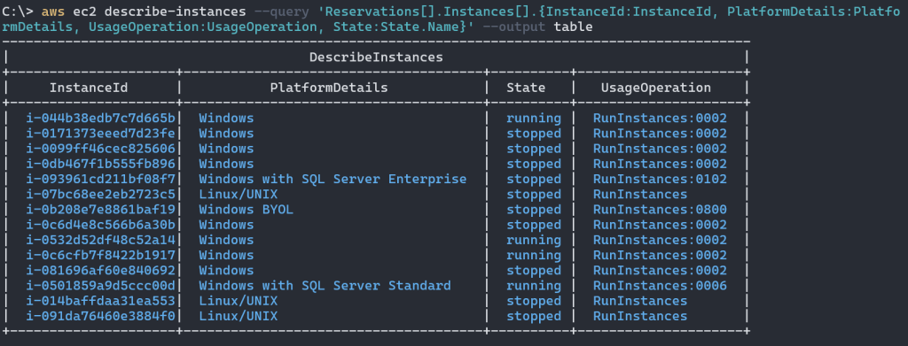
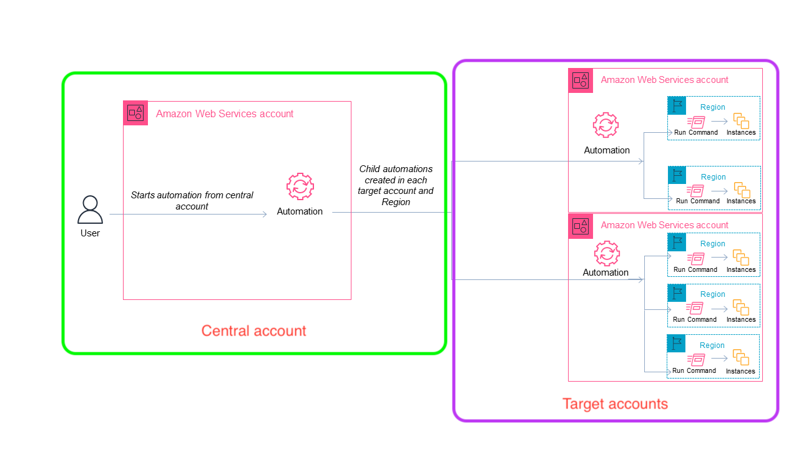
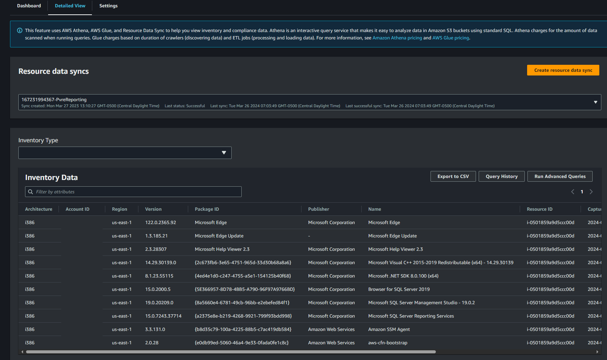

# Collecting platform and billing details for Microsoft licensing on AWS
By Rob Higareda

## Introduction

When you’re running Microsoft Windows workloads on AWS, you may want to review your Microsoft licensing usage. AWS allows you to leverage your existing Microsoft license investments through [Bring Your Own License](https://aws.amazon.com/windows/resources/licensing/#Bring_existing_licenses_to_Dedicated_Hosts) (BYOL), subject to Microsoft’s license terms. You also have the option to use AWS [License Included](https://aws.amazon.com/windows/resources/licensing/#Launch_licensed_Amazon_Machine_Images) (LI) instances to take advantage of pay-as-you-go (PAYG) licensing for Microsoft workloads. License included [Amazon Elastic Cloud Compute](https://aws.amazon.com/ec2/) (Amazon EC2) instances include the licensing cost of Microsoft Windows Server and/or Microsoft SQL Server in the compute costs. Regardless of which option you choose, or if you have a mixture of bring your own license and license included, you can inventory your Amazon EC2 instances for Microsoft licenses. With this inventory process, you will have visibility into whether you are using AWS LI or BYOL for Windows Server and/or SQL Server. AWS License Manager is a free tool that can be used to track your licenses, however if you are not using this, you will need to create a manual report to find your license usage. There are a couple of ways of doing this depending on the size of your environment. 

[Collecting platform and billing details for Microsoft licensing on AWS](https://aws.amazon.com/blogs/modernizing-with-aws/collecting-platform-and-billing-details-for-microsoft-licensing-on-aws/) blog post covers a manual method of collecting this information and point you to [How to create an Amazon EC2 AMI usage and billing information report](https://aws.amazon.com/blogs/modernizing-with-aws/how-to-create-an-amazon-ec2-ami-usage-and-billing-information-report/) blog post for an automated solution.


## Manual collection process
AWS uses an [AWS billing code](https://docs.aws.amazon.com/AWSEC2/latest/UserGuide/billing-info-fields.html#billing-info) to show how you’re billed for EC2 instances. For EC2 instances that are BYOL for Microsoft Windows Server and Microsoft SQL Server, AWS does not charge you for the license. There is a Microsoft requirement to host instances leveraging Windows Server BYOL on dedicated infrastructure ([EC2 Dedicated Hosts](https://aws.amazon.com/ec2/dedicated-hosts/)). For Microsoft SQL Server if you have Software Assurance, you can run it on Shared Tenancy EC2. If you don’t have Software Assurance for SQL Server, you will need to leverage Dedicated Hosts as well (You can read more about all the licenses requirements [here](https://aws.amazon.com/blogs/modernizing-with-aws/explore-licensing-options-for-your-microsoft-workloads-on-aws/)). For EC2 instances leveraging AWS LI, AWS includes the licensing costs and compute costs. This removes the licensing responsibilities from you. The commands we will use show the Instance ID, and the corresponding AWS billing code. This helps determine whether you have supplied the Microsoft Windows Server and SQL Server licenses, or if you are leveraging pay as you go from Amazon with LI. For this article, we focus on Table 1, listing Platform Details and Usage Operations.

| Platform Details | Usage Opertaions |
| --- | --- |
| Windows| RunInstances:0002|
| Windows BYOL | RunInstances:0800|
| Windows with SQL Server Enterprise * | RunInstances:0102 |
| Windows with SQL Server Standard * | RunInstances:0006 |
|SQL Server Enterprise |RunInstances:0100|
|SQL Server Standard |RunInstances:0004|
|SQL Server Web|RunInstances:0200|

* If two software licenses are associated with an AMI, the Platform details field shows both.

The table shows the variations of items for Microsoft products and their associated AWS billing code. In case your organization requires a formal review, you will need details in a reportable manner. Your goal will be to show which of your instances in AWS are license included or bring your own license. That can be determined by the RunInstances code in the table.

This first command is an output in JSON format, which is shown in Figure 1. run the example command to get information about your EC2 instances.

```
aws ec2 describe-instances --query 'Reservations[].Instances[].{InstanceId:InstanceId, PlatformDetails:PlatformDetails, UsageOperation:UsageOperation, State:State}' --output json 
```



This command provides a human-readable format. It uses the same filters as the previous command, but as shown in figure 2, it’s now in tabular format. The only change we’ve made to the command is to use the –output table option.


```
aws ec2 describe-instances --query 'Reservations[].Instances[].{InstanceId:InstanceId, PlatformDetails:PlatformDetails, UsageOperation:UsageOperation}' --output table
```


If you need to provide this as a report to another team, this is possible by exporting the data to file. To do this, you simply need to add an output method to the commands.

The following command uses the same parameters as the JSON output command but writes it to text. In this example it’s being sent to a file named instancenilling.txt as an output.

```
aws ec2 describe-instances --query ‘Reservations[].Instances[].{InstanceId:InstanceId, PlatformDetails:PlatformDetails, UsageOperation:UsageOperation}’ --output text > instancebilling.txt
```

## Automated collection process

While the previous AWS CLI commands work for a few accounts; If you have hundreds of accounts in various regions, it is a tedious process to run the CLI command. Luckily, there’s a solution that exists to help get this information at scale. While this article will not cover the solution in-depth, the [How to create an Amazon EC2 AMI usage and billing information report](https://aws.amazon.com/blogs/modernizing-with-aws/how-to-create-an-amazon-ec2-ami-usage-and-billing-information-report/) blog is here to help. It explains the use of the AWS Billing info and similarly uses the previous AWS CLI commands to collect this information for you in an automated way. This allows multi-account, multi-region aggregation of the data into one location. The blog highlights the details for deploying the solution, and in the end, you will have a solution like the image in Figure 4. The architecture diagram includes your AWS central account, for inventory collection, including your AWS workloads account, where your EC2 instances are running Windows and SQL Server. It also leverages AWS Systems Manager run commands that automate the collection of billing codes from your EC2 instances in each account. All this data is then sent back to your central account for review.



With the deployed solution you will track if you are using BYOL or LI, and have a report listed by instance automatically created for you.

## Other licenses to consider and how to inventory them 

For customers running Microsoft workloads in AWS, or looking to migrate workloads to AWS commercial licenses can be a large cost item for them. Ahead of a migration, audit, or Microsoft Enterprise Agreement renewal, customers should consider doing an Optimization and Licensing Assessment with AWS. An OLA helps avoid unnecessary licensing costs with the results generated though the AWS OLA process. During an OLA, AWS models licensing scenarios, including license-included or BYOL instances, for flexibility in managing seasonal workloads and agile experimentation. An AWS OLA models both dedicated and license-included environments, letting you pay for what you use to get the most out of your cloud compute and licensing costs. AWS Can additionally help review SQL Server features in use by the customer and potentially help reduce costs further by downgrading SQL Server editions from Enterprise to Standard or completely remove costs in some cases where SQL Server licenses are being purchased for Developer environments.  You can read more about the [OLA process online](https://aws.amazon.com/optimization-and-licensing-assessment/).

## Other licenses to consider

The previous information will provide you with insights into what is being billed by AWS for Microsoft Windows licenses and SQL Server. You will not have info about what your users have installed after the launch of an EC2 instance. There may be other Microsoft licenses you need to report on that users installed after an instance launch. These include products like Microsoft SharePoint Server, Exchange Server, Azure DevOps Server, or other software that you want to assure compliance with Microsoft licensing rules on AWS. For this, you can leverage [Inventory, a feature of AWS Systems Manager](https://docs.aws.amazon.com/systems-manager/latest/userguide/systems-manager-inventory.html) as long as you have the [Systems Manager agent](https://docs.aws.amazon.com/systems-manager/latest/userguide/ssm-agent.html) installed on your EC2 instances.

Once you have a Systems Manager Inventory setup, you will [create an aggregator](https://docs.aws.amazon.com/systems-manager/latest/userguide/sysman-inventory-configuring.html#sysman-inventory-config-collection-one-click) to receive information in one location for your accounts. As displayed in Figure 5, you will find all instances and software installed.



With the inventory setup, you can now export the report and use it to review software installed on your EC2 instances. To export the report, click on the Export to CSV option in the AWS console and save the file for review.

## Conclusion

In this short guide, , we provided information to help you get insights into how to retrieve licensing information about the instances in your environment running Microsoft products. This will help you provide your organization with a detailed set of information on your licensing usage. This info is also useful to you to understand where you are spending money on commercial licenses. AWS offers a no cost program for customers to assess their compute and commercial OS licenses as well called the [Optimization and Licensing Assessment](https://aws.amazon.com/optimization-and-licensing-assessment/). Leverage this program for workloads moving to AWS and workloads currently running on AWS. Please reach out to the Microsoft on AWS Cost Optimization team if you have questions about helping to reduce costs with Microsoft workloads on AWS. You can reach the team at optimize-microsoft@amazon.com. For general licensing questions, please reach out to microsoft@amazon.com.

AWS has significantly more services, and more features within those services, than any other cloud provider, making it faster, easier, and more cost effective to move your existing applications to the cloud and build nearly anything you can imagine. Give your Microsoft applications the infrastructure they need to drive the business outcomes you want. Visit our .NET on AWS and AWS Database blogs for additional guidance and options for your Microsoft workloads. Contact us to start your migration and modernization journey today.
