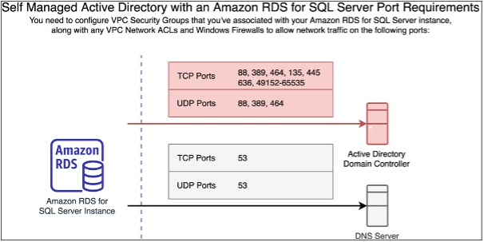

# Scripted prerequisites check for integrating Amazon RDS for SQL Server with self-managed Active Directory
by Ben Groeneveld

For customers aiming to deploy RDS for SQL Server and integrate it with a self-managed Active Directory for Windows Authentication, it's crucial to ensure that all key prerequisites are met before initiating the provisioning of the RDS instance.

To make things easier, I have created the following scripts that can assist with this validation as well as assist with troubleshooting efforts for customers who are running into issues during deployment.

## Network
Make sure that you have met the following network configurations:

- Connectivity configured between the Amazon VPC where you want to create the RDS for SQL Server DB instance and your self-managed Active Directory. You can set up connectivity using AWS Direct Connect, AWS VPN, VPC peering, or AWS Transit Gateway.

- For VPC security groups, the default security group for your default Amazon VPC is already added to your RDS for SQL Server DB instance in the console. Ensure that the security group and the VPC network ACLs for the subnet(s) where you're creating your RDS for SQL Server DB instance allow traffic on the ports and in the directions shown in the following diagram.



The following table identifies the role of each port.

|  Protocol | Ports | Role |
| ------------- |:-------------:| :-------------:|
| TCP/UDP |53  | Domain Name System (DNS) |
| TCP/UDP| 88|Kerberos authentication|
| TCP/UDP|464 | Change/Set password|
| TCP/UDP|389 | Lightweight Directory Access Protocol (LDAP)|
| TCP |135  | Distributed Computing Environment / End Point Mapper (DCE / EPMAP) |
| TCP|445|Directory Services SMB file sharing|
| TCP|636| Lightweight Directory Access Protocol over TLS/SSL (LDAPS)|
| TCP|49152 - 65535 | Ephemeral ports for RPC|

### INPUT
The following PowerShell script will verify the necessary network ports. For accuracy, run the script from a Windows instance located in the same VPC and subnet where you plan to deploy the RDS instance.

The TCP test will tell you whether the port is open or closed.

The UDP test will merely try to send a packet to the port. If there's no error on sending, it'll tell you the packet was sent. This doesn't mean the port is open and listening; it just means the packet was sent without any error on the client's end. UDP is connectionless, and as such, doesn't offer as clear a test for connectivity as TCP.

> Do note, the script does not test TCP ports 49152 – 65535 (Ephemeral ports for RPC).

> Important: Replace "$ip" with the IP address to check connectivity.

> Ensure you run the PowerShell script with elevated permissions.

```
# Define the target IP
$ip = "10.39.233.12"

# Define the ports to test
$ports = @(
    @{ Protocol = "TCP"; Port = 53; },
    @{ Protocol = "UDP"; Port = 53; },
    @{ Protocol = "TCP"; Port = 88; },
    @{ Protocol = "UDP"; Port = 88; },
    @{ Protocol = "TCP"; Port = 464; },
    @{ Protocol = "UDP"; Port = 464; },
    @{ Protocol = "TCP"; Port = 389; },
    @{ Protocol = "UDP"; Port = 389; },
    @{ Protocol = "TCP"; Port = 135; },
    @{ Protocol = "TCP"; Port = 445; },
    @{ Protocol = "TCP"; Port = 636; }
)

foreach ($entry in $ports) {
    $port = $entry.Port
    $protocol = $entry.Protocol
    
    if ($protocol -eq "TCP") {
        # Testing TCP port using Test-NetConnection
        $result = Test-NetConnection -ComputerName $ip -Port $port -InformationLevel Quiet
        if ($result) {
            Write-Host "TCP port $port is open on $ip"
        } else {
            Write-Host "TCP port $port is closed on $ip"
        }
    } elseif ($protocol -eq "UDP") {
        # Testing UDP port (this method only checks if it can send without error, not if the packet is received)
        try {
            $udpClient = New-Object System.Net.Sockets.UdpClient
            $udpClient.Connect($ip, $port)
            $udpClient.Send([byte[]](1..4), 4) | Out-Null
            $udpClient.Close()
            Write-Host "UDP packet sent to port $port on $ip"
        } catch {
            Write-Host "Failed to send UDP packet to port $port on $ip - $_"
        }
    }
}
```

### Active Directory Organisational Unit

The below PowerShell script can be used to validate that the OU they intend to use is valid. Run this script in a PowerShell session with the necessary permissions to read objects in Active Directory, and it will tell you whether the given OU exists or not.

> First, ensure you have the ActiveDirectory module installed. If it's not installed, you can get it by installing the Remote Server Administration Tools (RSAT) or by using Install-WindowsFeature.
> 
> Important: Replace "$ouPathToCheck" with the desired OU path.

```
# Import the ActiveDirectory module
Import-Module ActiveDirectory

# Function to validate OU path
function Validate-OUPath {
    param (
        [Parameter(Mandatory=$true)]
        [string]$OUPath
    )

    try {
        # Try to get the OU from the provided path
        $ou = Get-ADOrganizationalUnit -Identity $OUPath -ErrorAction Stop

        # If the above command doesn't throw an error, the OU exists
        Write-Output "OU exists!"
    } catch {
        # If there's an error, the OU probably doesn't exist or there's a permission issue
        Write-Output "OU does not exist or there was an error checking. Details: $_"
    }
}

# Your OU path
$ouPathToCheck = "OU=RDS,OU=test,DC=test,DC=local"

# Validate the provided OU path
Validate-OUPath -OUPath $ouPathToCheck
```
