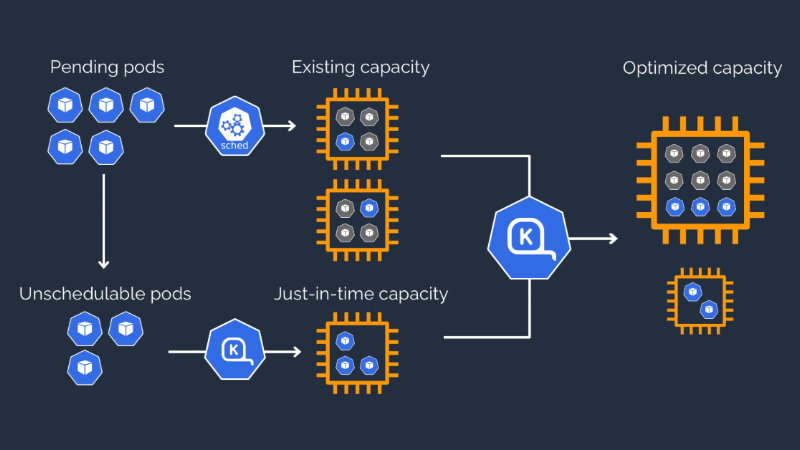

# Running Windows Containers with Karpenter
by Luciano Bernardes

### Introduction
[Karpenter](https://karpenter.sh/) is an advanced auto-scaling solution designed to optimize resource utilization in Kubernetes infrastructure, such as Amazon Elastic Kubernetes Service (EKS), with [support for Windows workloads](https://aws.amazon.com/about-aws/whats-new/2023/07/karpenter-windows-containers/). Unlike traditional cluster autoscalers, Karpenter dynamically provisions nodes based on real-time workload demands, offering faster scaling and more efficient resource management. This makes Karpenter particularly valuable for organizations running Windows container deployments in Kubernetes environments, enabling them to achieve better performance, cost-efficiency, and operational flexibility.

In the following sections, we'll provide the essential steps to configure and deploy Karpenter for Amazon EKS clusters with Windows workload support. For more detailed instructions and additional resources, please refer to the section at the end of this document.

### Install Karpenter on Amazon EK: Quick Reference
Here's a summary of the Karpenter installation steps for Windows support on EKS:

1. Prerequisites Setup:
   - Install Karpenter using Helm chart
   - Configure necessary IAM roles and policies
   - Set up AWS IRSA (IAM Roles for Service Accounts)

2. Key Configuration Steps:
   - Add Karpenter Helm repository
   - Create namespace for Karpenter
   - Deploy Karpenter with Windows-specific settings using Helm
   - Configure required environment variables

3. Verification
   - Confirm Karpenter controller deployment
   - Verify Karpenter webhook service
   - Check running pods in karpenter namespace

4. Post-Installation:
   - Set up node provisioner configuration
   - Configure default provisioner for Windows workloads
   - Enable Windows support in the EKS cluster

This process establishes the foundation for Karpenter to manage Windows node scaling in your EKS cluster.

### Set up Karpenter for Windows Nodes: Quick Reference

Here's a summary of configuring Karpenter for Windows workloads:

1. Provisioner Setup:
   - Create a Windows-specific provisioner
   - Configure node requirements (OS family: Windows)
   - Set instance types and capacity specifications
   - Define node expiry and termination conditions

2. Key Configuration Elements:
   - Specify Windows Server as the operating system
   - Set resource limits and constraints
   - Configure instance types (e.g., t3.large)
   - Define startup taints and labels

3. Requirements:
   - Enable Windows support in EKS cluster
   - Configure security groups
   - Set up appropriate IAM roles
   - Define subnet configurations

4. Validation:
   - Apply provisioner configuration
   - Verify provisioner status
   - Check for proper Windows node template settings

The configuration ensures Karpenter can properly manage Windows nodes, including their lifecycle, scaling, and resource allocation within the EKS cluster.

## EKS Node Viewer

EKS Node Viewer is a powerful visualization tool designed to provide real-time monitoring and insights into your EKS cluster's node resources. It offers an intuitive graphical interface that helps operators and administrators understand resource allocation, capacity utilization, and overall cluster health at a glance. Here's a quick reference of configuring EKS Node Viewer:

1. Installation:
   - Deploy EKS Node Viewer using a Helm chart
   - Configure necessary RBAC permissions

2. Key Features:
   - Real-time visualization of node resources
   - Display of CPU and memory usage across nodes
   - Representation of pod distribution on nodes

3. Usage:
   - Access the EKS Node Viewer dashboard via port-forwarding
   - Monitor node capacity and resource utilization
   - Observe changes in resource allocation as pods are scheduled or removed

The EKS Node Viewer significantly simplifies cluster resource management by providing a clear, visual representation of resource utilization. This tool is invaluable for identifying bottlenecks, optimizing node utilization, and maintaining overall cluster health. By offering real-time insights, it empowers administrators to make informed decisions about resource allocation and scaling strategies.

When integrated with Karpenter, the EKS Node Viewer becomes even more powerful, offering visual feedback on Karpenter's scaling actions for Windows nodes. This combination allows for efficient verification of proper Windows node provisioning and helps ensure that the cluster is running optimally. Together, these tools enhance the management and performance of Windows workloads in an EKS environment, leading to improved resource efficiency and cost-effectiveness.

## More information

For a comprehensive, hands-on guide to implementing Karpenter on Amazon EKS and Windows support, including step-by-step instructions and best practices, we recommend exploring the official [Windows Containers on AWS workshop](https://catalog.us-east-1.prod.workshops.aws/workshops/1de8014a-d598-4cb5-a119-801576492564/en-US/module1-eks/lab9-karpenter-windows). This resource provides in-depth technical walkthroughs, practical examples, and expert insights to help you master Windows containerization in AWS environments.